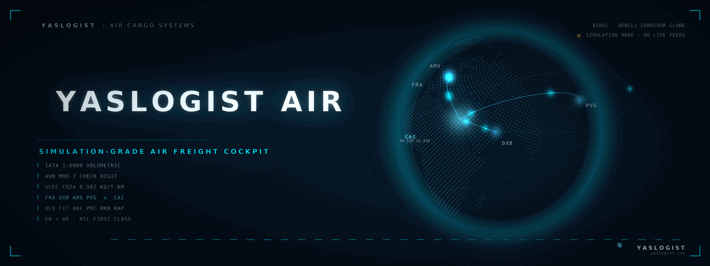
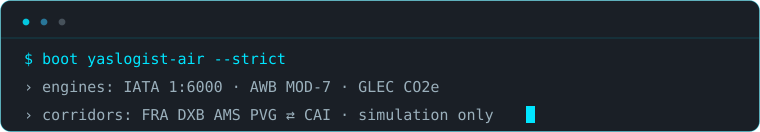
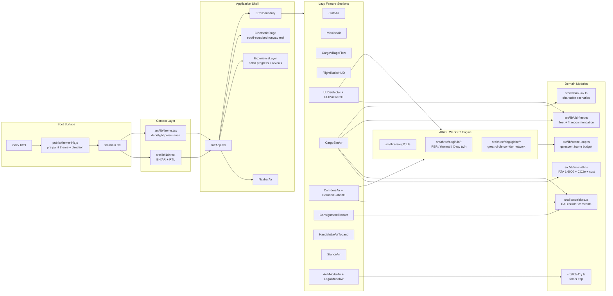
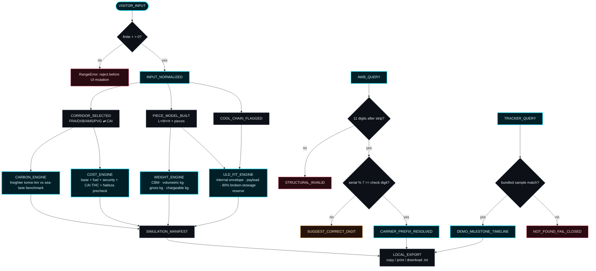
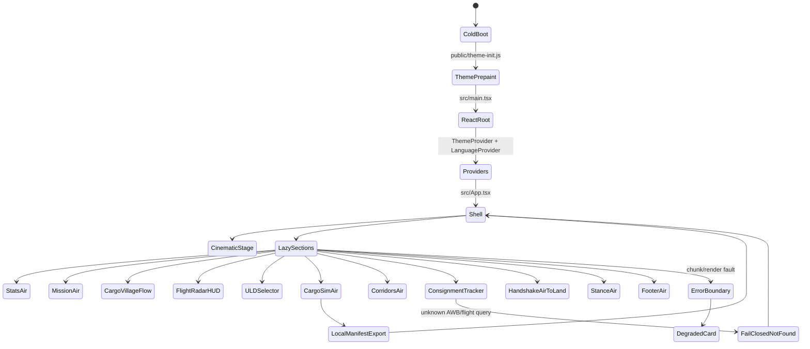
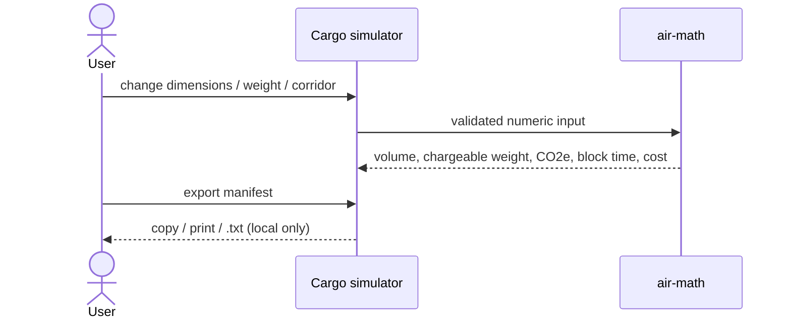

<div align="center">



<sub><code>hero rendered procedurally by assets/readme/src/render_hero.py from src/three/airgl geodesy · seamless 8s loop · static poster at assets/readme/yaslogist-hero.png</code></sub>

</div>

<div align="center">

# YASLOGIST AIR

<sub><code>simulation-grade air freight cockpit · CAI corridor intelligence · bilingual EN/AR · no carrier/customs live integration</code></sub>

[](.github/workflows/quality.yml)
[](assets/zero-defect-gate.json)
[](assets/quality-latency.json)
[](assets/kinetic-refresh.json)
[](https://air.yaslogist.com)

[](package.json)
[](package.json)
[](package.json)
[](package.json)

**[Live Preview](https://air.yaslogist.com)** · **[Quality Workflow](.github/workflows/quality.yml)** · **[Kinetic Workflow](.github/workflows/kinetic-readme.yml)** · **[Reconstruction Log](docs/RECONSTRUCTION.md)** · **[Issues](../../issues)**

</div>

<div align="center">

</div>

---

## 01 / THE SYSTEM

<table align="center">
  <tr>
    <td width="50%" valign="top">
      <sub><code>◢ SYSTEM SURFACE</code></sub><br/><br/>
      <b>YASLOGIST AIR</b> is a static, client-only React cockpit for air-freight simulation. It computes chargeable weight, corridor carbon, indicative cost, ULD fit, AWB Mod-7 validity, cargo-village handoff, and demo consignment state from local constants only.
      <br/><br/>
      <code>boundary:</code> no airline feed · no IATA booking feed · no Nafeza/customs feed · no backend database · no live AWB status.
    </td>
    <td width="50%" valign="top">
      <sub><code>◢ EXECUTION MATRIX</code></sub><br/><br/>
      <table>
        <tr><td><code>runtime</code></td><td>React 19 + TypeScript strict</td></tr>
        <tr><td><code>render</code></td><td>Vite 6 + Tailwind CSS 4 + WebGL2 AIRGL</td></tr>
        <tr><td><code>state</code></td><td><code>useState</code>, <code>localStorage</code>, URL query params</td></tr>
        <tr><td><code>quality</code></td><td>typecheck → tests → build → bundle budget → audit</td></tr>
        <tr><td><code>motion</code></td><td>procedural hero GIF + SMIL SVG kinetics + in-app WebGL/scroll kinetics</td></tr>
      </table>
    </td>
  </tr>
</table>

<div align="center"></div>

## 02 / CORE CAPABILITIES

<table align="center">
  <tr><th>Capability</th><th>Engine</th><th>Output</th><th>Boundary</th></tr>
  <tr><td>Chargeable weight</td><td><code>calculateAirFreight</code></td><td>CBM, volumetric kg, gross kg, chargeable kg, billing basis, density class.</td><td>Simulation math only.</td></tr>
  <tr><td>Carbon comparison</td><td><code>calculateAirFreight</code></td><td>Freighter CO2e vs container-vessel benchmark for selected corridor.</td><td>Average factor estimate, not certified shipment emissions.</td></tr>
  <tr><td>Indicative pricing</td><td><code>estimateAirFreightCost</code></td><td>Base freight, fuel, security, CAI terminal handling, Nafeza pre-validation fee.</td><td>Benchmark estimate, not a quotation.</td></tr>
  <tr><td>ULD recommendation</td><td><code>recommendUld</code></td><td>AKE, PMC, RKN, RAP fit assessment with blockers and utilization.</td><td>Planning heuristic, not carrier load acceptance.</td></tr>
  <tr><td>AWB validation</td><td><code>validateIataAwb</code></td><td>Mod-7 pass/fail, airline prefix lookup, correction suggestion.</td><td>Structure only, not booking/customs status.</td></tr>
  <tr><td>3D twin</td><td><code>src/three/airgl/uld/*</code></td><td>PBR, thermal, X-ray inspection modes.</td><td>Procedural visualization, no live manifest.</td></tr>
  <tr><td>Corridor globe</td><td><code>src/three/airgl/globe/*</code></td><td>Great-circle routes, aircraft arc motion, landmask, terminator.</td><td>Bundled route dataset.</td></tr>
  <tr><td>Demo tracking</td><td><code>ConsignmentTracker</code></td><td>Five-stage cargo milestone cards for bundled samples.</td><td>Fail-closed for unknown identifiers.</td></tr>
</table>

<div align="center"></div>

## 03 / ENGINEERING ARCHITECTURE

<details open>
<summary><strong>Client topology</strong></summary>



</details>

<details>
<summary><strong>Module inventory</strong></summary>

<table>
  <tr><th>Path</th><th>Role</th><th>Invariant</th></tr>
  <tr><td><code>src/App.tsx</code></td><td>Shell, lazy section orchestration, modal ownership, analytics mount.</td><td>One Suspense + ErrorBoundary per feature section.</td></tr>
  <tr><td><code>src/components/CargoSimAir.tsx</code></td><td>Scenario UI for dimensions, gross weight, route, cooling, cost/carbon, export.</td><td>All calculations delegated to pure library functions.</td></tr>
  <tr><td><code>src/lib/air-math.ts</code></td><td>IATA volumetric divisor, AWB checksum/correction, CO2e, indicative pricing.</td><td>Finite positive inputs or synchronous <code>RangeError</code>.</td></tr>
  <tr><td><code>src/lib/uld-fleet.ts</code></td><td>ULD constants and recommendation engine.</td><td>Horizontal rotation only; 90% broken-stowage reserve; active-cooling match required.</td></tr>
  <tr><td><code>src/lib/corridors.ts</code></td><td>FRA/DXB/AMS/PVG ⇄ CAI lane constants and sea benchmarks.</td><td>One shared data source for simulator and corridor browser.</td></tr>
  <tr><td><code>src/components/ConsignmentTracker.tsx</code></td><td>Bundled demo consignment lookup.</td><td>Unknown query returns not found; never synthesizes operational status.</td></tr>
  <tr><td><code>src/three/airgl/</code></td><td>WebGL2 ULD digital twin and corridor globe.</td><td>Dedicated <code>vendor-three</code> chunk, explicit resource disposal, no render-loop allocations.</td></tr>
  <tr><td><code>scripts/check-bundle.mjs</code></td><td>Production asset budget gate.</td><td>App JS ≤ 515 KB raw; CSS ≤ 112 KB raw; exactly one vendor-three chunk ≤ 592 KB raw.</td></tr>
  <tr><td><code>assets/readme/src/render_hero.py</code></td><td>Procedural README hero renderer (this page's opening visual).</td><td>Reuses repo geodesy, landmask, airport anchors and monogram geometry; periodic functions only, so the loop is seamless.</td></tr>
</table>

</details>

<div align="center"></div>

## 04 / SYSTEM BLUEPRINT



<details>
<summary><strong>Runtime state machine</strong></summary>



</details>

<div align="center"></div>

## 05 / EXECUTION INTELLIGENCE



<table align="center">
  <tr><th>Stage</th><th>Behavior</th><th>Guarantee</th></tr>
  <tr><td><code>boot</code></td><td><code>theme-init.js</code> pre-paints theme + direction before React mounts.</td><td>No flash of wrong theme/direction in either locale.</td></tr>
  <tr><td><code>validate</code></td><td>Numeric inputs checked finite &gt; 0 before any UI mutation.</td><td>Synchronous <code>RangeError</code>, never NaN propagation.</td></tr>
  <tr><td><code>compute</code></td><td>Pure functions: IATA 1:6000 volumetrics, GLEC CO2e, indicative cost, ULD fit.</td><td>Deterministic, unit-tested, zero network.</td></tr>
  <tr><td><code>render</code></td><td>AIRGL WebGL2 twin + corridor globe in an isolated <code>vendor-three</code> chunk.</td><td>Quiescent frame budget; explicit GL disposal.</td></tr>
  <tr><td><code>export</code></td><td>Manifest leaves the app only via clipboard / print / local .txt download.</td><td>No upload path exists.</td></tr>
</table>

<div align="center"></div>

## 06 / IGNITION

<details open>
<summary><strong>Local execution</strong></summary>

```bash
npm ci
npm run dev -- --host 0.0.0.0
npm run check
npm run audit
```

</details>

<details>
<summary><strong>CI contract</strong></summary>

<table>
  <tr><th>Gate</th><th>Command</th><th>Required State</th></tr>
  <tr><td>Type safety</td><td><code>npm run typecheck</code></td><td>0 TypeScript errors.</td></tr>
  <tr><td>Regression suite</td><td><code>npm test</code></td><td>All Vitest, Testing Library, a11y, CSP, theme, scene-loop tests pass.</td></tr>
  <tr><td>Build</td><td><code>npm run build</code></td><td>Vite production bundle emits successfully.</td></tr>
  <tr><td>Bundle budget</td><td><code>npm run check:bundle</code></td><td>Per-file and app-total JS/CSS ceilings respected; exactly one <code>vendor-three</code> chunk.</td></tr>
  <tr><td>Supply chain</td><td><code>npm audit --omit=dev --audit-level=high</code></td><td>0 high/critical production vulnerabilities.</td></tr>
</table>

</details>

<div align="center"></div>

## 07 / DEEP SYSTEM ACCESS

<details>
<summary><strong>Kinetic layer — how this page moves</strong></summary>

<table align="center">
  <tr>
    <td valign="top"><code>hero</code></td>
    <td>Procedural 8-second seamless loop: dot-shell planet (Fibonacci lattice + repo landmask), great-circle corridor arcs with the repo's apex profile, traveling pulses, hub rings, orbital traveler, solar terminator. Rendered by <code>assets/readme/src/render_hero.py</code>; every animation term is periodic, so the loop closes exactly.</td>
  </tr>
  <tr>
    <td valign="top"><code>statement</code></td>
    <td><code>assets/readme/statement-typing.svg</code> — SMIL terminal typing loop in the same Electric Cyan system.</td>
  </tr>
  <tr>
    <td valign="top"><code>dividers</code></td>
    <td><code>assets/readme/divider-pulse.svg</code> — traveling light pulse separators between sections.</td>
  </tr>
  <tr>
    <td valign="top"><code>factory</code></td>
    <td><code>.github/workflows/kinetic-readme.yml</code> runs every 12 hours, calls <code>Platane/snk/svg-only@v3</code>, writes <code>assets/github-snake*.svg</code>, writes Shields endpoint JSON, and commits the generated assets.</td>
  </tr>
</table>

<p align="center">
  <picture>
    <source media="(prefers-color-scheme: dark)" srcset="assets/github-snake-dark.svg" />
    <source media="(prefers-color-scheme: light)" srcset="assets/github-snake.svg" />
    
  </picture>
</p>

</details>

<details>
<summary><strong>Live telemetry endpoint map</strong></summary>

<table align="center">
  <tr>
    <th>Signal</th>
    <th>Endpoint</th>
    <th>Source of Truth</th>
    <th>Fail Threshold</th>
  </tr>
  <tr>
    <td><code>quality gate</code></td>
    <td><code>img.shields.io/github/actions/workflow/status</code></td>
    <td><code>.github/workflows/quality.yml</code></td>
    <td>any failed typecheck/test/build/budget/audit step</td>
  </tr>
  <tr>
    <td><code>pipeline latency</code></td>
    <td><code>img.shields.io/endpoint → assets/quality-latency.json</code></td>
    <td>latest GitHub Actions run duration computed by kinetic workflow</td>
    <td><code>&gt; 600s</code> renders amber; failed/missing run renders red/gray</td>
  </tr>
  <tr>
    <td><code>zero-defect gate</code></td>
    <td><code>img.shields.io/endpoint → assets/zero-defect-gate.json</code></td>
    <td>latest <code>quality.yml</code> conclusion</td>
    <td>anything except <code>success</code></td>
  </tr>
  <tr>
    <td><code>kinetic refresh</code></td>
    <td><code>img.shields.io/endpoint → assets/kinetic-refresh.json</code></td>
    <td>scheduled README asset generation timestamp</td>
    <td>stale asset cadence beyond 12h schedule</td>
  </tr>
  <tr>
    <td><code>stack versions</code></td>
    <td><code>img.shields.io/github/package-json/dependency-version</code></td>
    <td><code>package.json</code></td>
    <td>dependency drift visible at read time</td>
  </tr>
  <tr>
    <td><code>edge availability</code></td>
    <td><code>img.shields.io/website</code></td>
    <td><code>https://air.yaslogist.com</code></td>
    <td>non-2xx/3xx response</td>
  </tr>
</table>

</details>

<details>
<summary><strong>Repository operating notes</strong></summary>

<table align="center">
  <tr><td><code>Node</code></td><td>22.x</td></tr>
  <tr><td><code>npm</code></td><td>10.x+</td></tr>
  <tr><td><code>env</code></td><td>No required variables. Optional suite URLs are documented in <code>.env.example</code>.</td></tr>
  <tr><td><code>deploy</code></td><td>Static Vite build. <code>vercel.json</code> ships CSP/security/cache headers.</td></tr>
  <tr><td><code>assets</code></td><td>README motion assets in <code>assets/</code> are generated by GitHub Actions; hero + SMIL kinetics live in <code>assets/readme/</code>; app assets remain in <code>public/assets/</code>.</td></tr>
  <tr><td><code>README_SNAKE_USER</code></td><td>Optional repository variable overriding the contribution-grid username; defaults to repository owner.</td></tr>
</table>

</details>

<details>
<summary><strong>Data + license boundary</strong></summary>

YASLOGIST AIR is a decision-support simulation. It does not connect to airlines, airports, customs systems, IATA operational systems, Nafeza, shipment IoT, or third-party freight pricing APIs. Local demo data may look operational; it is versioned source code and must remain labelled as demonstration output.

Code follows the repository license policy. Project-supplied imagery in <code>public/assets/</code> should be treated as project-owned/maintainer-provided unless separate license metadata is added. README kinetic assets are generated artifacts; no photographed or human-recorded motion is required.

</details>

<div align="center"></div>

## 08 / ENGINEERING STATUS

<p align="center">
  
  
</p>

<table align="center">
  <tr><th>Surface</th><th>Status</th><th>Evidence</th></tr>
  <tr><td>Volumetric / carbon / cost engines</td><td>✅ implemented, tested</td><td><code>src/lib/air-math.ts</code> + Vitest suite</td></tr>
  <tr><td>ULD fit engine + WebGL2 twin</td><td>✅ implemented, tested</td><td><code>src/lib/uld-fleet.ts</code>, <code>src/three/airgl/uld/*</code></td></tr>
  <tr><td>Corridor globe + terminator</td><td>✅ implemented, tested</td><td><code>src/three/airgl/globe/*</code> with embedded landmask</td></tr>
  <tr><td>AWB Mod-7 validator</td><td>✅ implemented, tested</td><td><code>validateIataAwb</code> + correction suggestion</td></tr>
  <tr><td>Bilingual EN/AR + RTL</td><td>✅ implemented</td><td><code>src/lib/i18n.tsx</code>, pre-paint direction</td></tr>
  <tr><td>Live carrier / customs / Nafeza feeds</td><td>⛔ out of scope by design</td><td>simulation boundary, enforced fail-closed</td></tr>
  <tr><td>Live AWB tracking</td><td>⛔ out of scope by design</td><td>bundled demo consignments only</td></tr>
</table>

<div align="center"></div>

## 09 / YASLOGIST

<table align="center">
  <tr>
    <td valign="middle" align="center">
      
      <br/><br/>
      <sub>
        <b>YASLOGIST</b> is the permanent creative-engineering signature behind this repository —
        the parent identity of the multimodal logistics intelligence suite
        (air · land · sea). Each project keeps its own operational identity;
        the YASLOGIST DNA — architectural precision, luminous restraint,
        verified claims — carries through every surface.
      </sub>
      <br/><br/>
      <sub><code>
        <a href="https://www.yaslogist.com">yaslogist.com</a> ·
        <a href="https://air.yaslogist.com">air.yaslogist.com</a> ·
        Electric Cyan <code>#00E5FF</code>
      </code></sub>
    </td>
  </tr>
</table>

<div align="center">

---

<sub><code>built for air.yaslogist.com · part of the YASLOGIST multimodal suite · hero + kinetics rendered procedurally from repository source data</code></sub>

</div>
