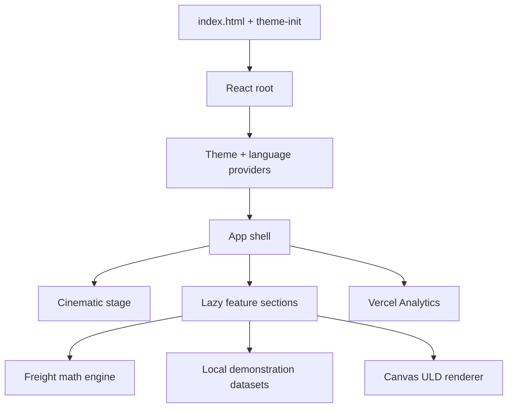

# YASLOGIST AIR

Bilingual (English/Arabic), responsive air-freight capability demonstration built with React 19, TypeScript, Vite 6, and Tailwind CSS 4. It includes an IATA-format AWB checksum tool, freight/carbon calculator, simulated shipment samples, corridor explorer, radar HUD, and an interactive canvas ULD viewer.

> **Data boundary:** this is a simulation. It is not connected to an airline, IATA, Nafeza, customs, airport, or live telemetry service. AWB checksum validity proves only number structure—not booking or clearance status.

## Run in minutes

Requirements: Node.js 22 and npm 10+.

```bash
npm ci
npm run dev
```

Open the URL printed by Vite. Production verification is one command:

```bash
npm run check
npm run audit
```

Build and preview:

```bash
npm run build
npm run preview -- --host 0.0.0.0
```

No environment variables are required; see `.env.example`.

## Quality controls

- `npm run typecheck` — strict TypeScript
- `npm test` — calculation, AWB, modal accessibility, keyboard, and tracker-flow tests
- `npm run check:bundle` — per-chunk JavaScript/CSS budgets
- `npm run audit` — dependency vulnerability gate
- `.github/workflows/quality.yml` runs all controls on pushes and pull requests
- `vercel.json` supplies CSP and browser security headers on Vercel

## Architecture



Feature sections are code-split, wrapped by loading states and an error boundary. Preferences remain local. There is no application backend or persistent user data.

Detailed reconstruction, behavioral specification, evidence, audit, and verification are in [`docs/RECONSTRUCTION.md`](docs/RECONSTRUCTION.md).

## Assets and licensing

The repository contains project-supplied imagery/video under `public/assets`. No external license metadata was present, so ownership/licensing remains to be confirmed before commercial redistribution. Google Fonts are loaded from their official stylesheet endpoints. Lucide icons are provided by the ISC-licensed `lucide-react` package. No new third-party visual asset was added by this upgrade.
