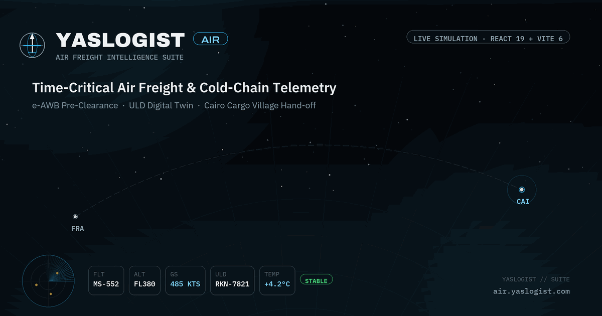
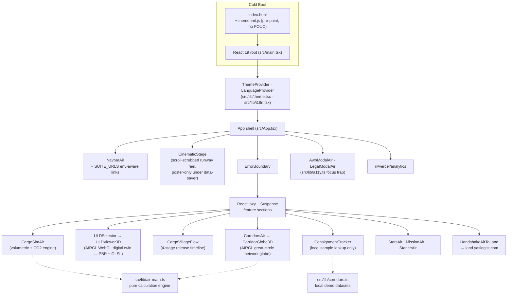
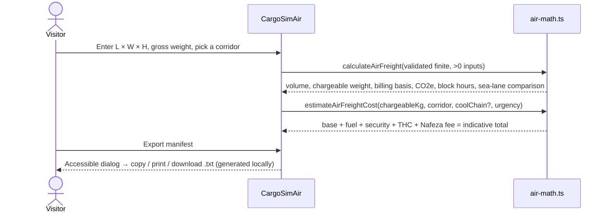
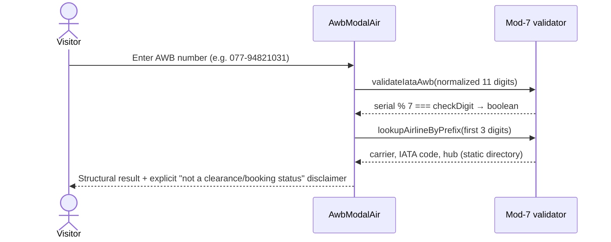
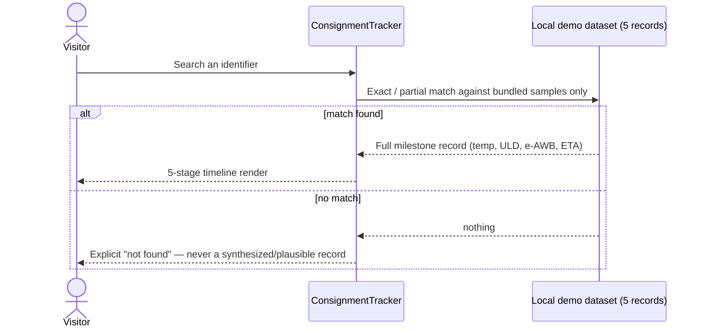

<div align="center">



# YASLOGIST AIR
### Air Freight Intelligence Suite — Technical Whitepaper

**A bilingual (EN/AR), simulation-grade air-freight cockpit**: IATA-checksum AWB tooling, a volumetric/chargeable-weight and carbon engine, a WebGL (PBR + GLSL) ULD digital twin and a great-circle network globe, a corridor intelligence browser, and a Cairo Cargo Village hand-off model — built on React 19, TypeScript, Vite 6, and Tailwind CSS 4.

[](.github/workflows/quality.yml)
[](package.json)
[](tsconfig.json)
[](vite.config.ts)
[](src/index.css)
[](#license--asset-provenance)

**[Live Preview](https://air.yaslogist.com)** · **[Reconstruction & Audit Log](docs/RECONSTRUCTION.md)** · **[Report an Issue](../../issues)**

</div>

> **Data boundary — read this first.** YASLOGIST AIR is an interactive **simulation**. It is not wired to an airline, IATA, Nafeza, an airport operator, or any live telemetry feed. The AWB checksum tool proves number *structure*, never booking or customs status. Every dataset in this repository — corridors, consignments, ULD specs, cost benchmarks — is a bundled, versioned constant, not a network call. This boundary is enforced in code (see [Core Workflows](#core-workflows)) and tested in CI.

---

## Table of contents

1. [System Architecture](#system-architecture)
2. [Feature Matrix](#feature-matrix)
3. [Core Workflows](#core-workflows)
4. [Tech Stack](#tech-stack)
5. [Quickstart](#quickstart)
6. [Quality Controls](#quality-controls)
7. [License & Asset Provenance](#license--asset-provenance)

---

## System Architecture

YASLOGIST AIR is a **static, client-only single-page application** — there is no server entry point, no database, and no session state. Every screen is derived from constants shipped in the bundle plus ephemeral `useState`/`localStorage` for theme and language. This is a deliberate constraint, not an oversight: it keeps the "simulation" boundary impossible to leak into something that *looks* operational.



**Design decisions that shape the architecture:**

| Decision | Why |
|---|---|
| **Feature sections are code-split** behind `React.lazy` + `Suspense`, wrapped in an `ErrorBoundary` | Keeps the initial bundle small and the app resilient — one broken panel degrades gracefully instead of white-screening the whole page. |
| **No fetch/XHR client anywhere in `src/`** | The single strongest guarantee that "simulation" stays true. Verified by grep in CI review and by the audit in `docs/RECONSTRUCTION.md`. |
| **Calculation logic lives in `src/lib`, UI lives in `src/components`** | `air-math.ts` and `corridors.ts` are framework-free, synchronously testable, and shared by every section that needs the same number (no duplicated constants drifting apart). |
| **Theme/direction resolved before paint** (`public/theme-init.js`) | Eliminates flash-of-wrong-theme and flash-of-wrong-direction on both cold load and bfcache restores. |
| **`SUITE_URLS` is preview-safe** (`src/lib/suite.ts`) | Public suite origins are the default, so browser previews never emit `localhost` links that resolve to the visitor's own machine. Local sibling apps remain opt-in through `VITE_HUB_URL`, `VITE_LAND_URL`, `VITE_OCEAN_URL`, and `VITE_AIR_URL`. |

---

## Feature Matrix

| Capability | Component(s) | What it actually does | Operational boundary |
|---|---|---|---|
| **Volumetric & chargeable-weight engine** | `CargoSimAir.tsx` → `air-math.ts` | Computes CBM volume, IATA 1:6000 volumetric weight, chargeable weight (`max(gross, volumetric)`), billing basis, stowed density vs the 166.7 kg/m³ pivot, and freight density class — for **multi-piece consignments** (identical-piece count × dimensions/weight). | Pure math on user input — no tariff lookup, no booking. |
| **ULD load-fit planner** | `CargoSimAir.tsx` → `uld-fleet.ts: recommendUld` | Assesses the simulated consignment against every unit in the ULD fleet (internal envelope with horizontal-rotation-only orientation, net payload = max gross − tare, 10% broken-stowage volume reserve, GDP cool-chain matching) and recommends the smallest fitting unit with volume/payload utilization bars and per-unit exclusion reasons. | Planning heuristic on published envelope specs — final build-up is governed by carrier stowage rules. |
| **Shareable scenario deep links** | `CargoSimAir.tsx` → `sim-link.ts` | Serializes the simulator state into `?sim=1&l=…` query params; restored (with range clamping and corridor pinning) on load. One button copies the link. | The URL is the only carrier — no storage, no network. |
| **Carbon intensity comparison** | `CargoSimAir.tsx` → `air-math.ts` | Estimates tonnes CO₂e for the chargeable weight over the flown distance (GLEC/EN 16258 freighter factor) and benchmarks it against an equivalent container-vessel sailing. | Mode-comparison average, not a shipment-specific certified figure. |
| **Indicative air-freight cost model** | `air-math.ts: estimateAirFreightCost` | Benchmarks base rate (by corridor), fuel/security surcharges, Cairo Cargo Village terminal handling, and a Nafeza pre-validation fee into a total USD estimate. | Explicitly indicative — not a quoted or contractual rate. |
| **IATA AWB Mod-7 checksum validator & corrector** | `AwbModalAir.tsx` → `air-math.ts` | Validates the 11-digit AWB structure (`serial % 7 === checkDigit`), resolves the 3-digit carrier prefix to an airline/hub directory, and on failure computes the expected check digit and offers a one-click "did you mean" correction. | Structural validity only — never asserts booking, customs, or shipment status. |
| **ULD digital twin** | `ULDSelector.tsx` + `ULDViewer3D.tsx` → `uld-fleet.ts` | Browsable fleet of 4 Unit Load Devices (AKE/LD3, PMC pallet, RKN & RAP active cold-chain) with tare/max-gross/volume/net-payload specs and usable internal envelopes, rendered as a real-time WebGL digital twin on the AIRGL engine (orbit/zoom, damped door hinge, exploded assembly, GLSL thermal and X-ray modes, instanced payloads). Fleet data is a single shared constant also consumed by the simulator's load-fit planner. | Spec sheet + visualization — not a live loading manifest. |
| **Cargo Village release timeline** | `CargoVillageFlow.tsx` | Four-stage narrative from touchdown → tarmac cold-chain transfer → digital e-AWB/ACID pre-clearance → reefer-truck gate-out, each stage tagged with a target time window and the compliance reference it maps to (IATA AHM 905, WHO GDP, Egypt Customs Law 207 / Nafeza). | Illustrative process model, not a live customs integration. |
| **Corridor intelligence browser** | `CorridorsAir.tsx` → `corridors.ts` | Four strategic lanes into Cairo (FRA, DXB, AMS, PVG) with distance, block time, weekly frequency, primary commodity mix, and a matched sea-freight benchmark (different port pair, real sailing distance — not derived from the air route). | Reference dataset, single source of truth shared with the calculator. |
| **Consignment tracker** | `ConsignmentTracker.tsx` | Looks up one of 5 bundled demo shipments by AWB/keyword and renders a 5-stage milestone timeline with temperature, ULD, and e-AWB status. | Unknown identifiers return **not found** — the baseline behavior of fabricating plausible telemetry for unknown AWBs was removed and is now a regression test. |
| **Live flight radar HUD** | `FlightRadarHUD.tsx` | Animated cockpit-style telemetry strip (altitude, ground speed, heading, vertical speed, ULD cooling status) for a representative inbound flight. | Scripted demonstration vector, clearly labeled as such in-UI. |
| **Air → Land hand-off** | `HandshakeAirToLand.tsx` | Visual and link hand-off from the air-freight narrative to `land.yaslogist.com`'s ground fleet, closing the multimodal loop. | Navigates to a sibling product surface; no shared session state. |
| **Bilingual, bidirectional UI** | `src/lib/i18n.tsx` | Full English/Arabic dictionary with instant `LTR`/`RTL` switching, Arabic-first typography (`Aref Ruqaa`/`IBM Plex Sans Arabic`), and `dir="ltr"` isolation for telemetry units so numbers never reverse. | — |
| **Dual theme engine** | `src/lib/theme.tsx` | Dark "Stratosphere" and light "Aero Daylight" themes, persisted to `localStorage`, resolved pre-paint to prevent flash. | — |
| **Accessible modal primitives** | `src/lib/a11y.ts`, `AwbModalAir.tsx`, `LegalModalAir.tsx` | Focus trap, focus restoration, `Escape`-to-close, backdrop-close, body-scroll lock — shared by every dialog in the app. | — |
| **Exportable simulation manifest** | Modal export flow | Generates a downloadable plain-text manifest of a simulated calculation, locally, with no network round-trip. | — |

---

## Core Workflows

Three sequences capture how a visitor actually moves through the product. Each is enforced by an automated test in `src/**/*.test.*`.

**1 — Freight simulation (dimensions → cost & carbon):**



**2 — AWB structural verification:**



**3 — Consignment lookup (truth-preserving by construction):**



**Invariants enforced in tests (`npm test`):**

- Calculation inputs must be finite and `> 0`; otherwise `RangeError` is thrown before any UI state updates.
- Volumetric weight is exactly `(L × W × H) / 6000`; chargeable weight is `max(gross, volumetric)`, with gross winning on an exact tie.
- AWB checksum accepts only 11 digits after stripping spaces/hyphens; validity requires `serialNumber % 7 === checkDigit`.
- An unmatched tracker query always renders "not found" — it can never fall back to generated telemetry.
- Dialogs trap focus, close on `Escape`/backdrop click, lock body scroll, and restore focus to the triggering element on close.
- `prefers-reduced-motion` disables decorative animation across the hero and HUD.
- Both Content-Security-Policy copies (`index.html` meta and the `vercel.json` header) declare identical directives, minus the header-only ones.
- The whole page renders with zero axe violations (colour-contrast excluded: jsdom has no layout engine).
- Every navbar anchor resolves to a section that actually mounts.

**Rendering cost policy (`src/lib/scene-loop.ts`):**

| Situation | Canvas repaints |
|---|---|
| ULD model off-screen or unmounted | none |
| `prefers-reduced-motion` and no interaction | none (ambient detail is frozen anyway) |
| Camera, door, explosion or mode change | the very next frame, unthrottled |
| Ambient detail only (fan, LED, particles, hotspot pulse) | ~30/s instead of 60/s |

The hero scroll scrubber follows the same rule: its easing loop stops as soon as the eased value reaches the scroll position and restarts on the next scroll, instead of holding a frame callback for the whole session. Simulated radar telemetry timers pause while the panel is off-screen or the tab is backgrounded.

---

## Tech Stack

| Layer | Choice | Rationale |
|---|---|---|
| **UI runtime** | React 19 + TypeScript 5.7 (strict) | Concurrent-ready rendering; strict mode catches drift between UI and the calculation types in `src/types/air-freight.ts` at compile time. |
| **Build tool** | Vite 6 | Sub-second HMR during development; Rollup-based production build with automatic code-splitting for every lazy section. |
| **Styling** | Tailwind CSS 4 (CSS-first token architecture, `@tailwindcss/vite`) | Design tokens (`--c-heading`, `--c-text`, `--glass-brd`, …) drive both themes from one source, avoiding hard-coded `text-white` contrast bugs. |
| **Icons** | `lucide-react` (ISC license) | Tree-shaken, consistent 1.5px-stroke geometric icon set matching the aviation HUD aesthetic. |
| **Utility** | `clsx` | Conditional class composition. `tailwind-merge` was removed: it cost ~27 KB of entry-chunk JS to serve one call site whose callers never produce conflicting utilities (see `src/utils/cn.ts`). |
| **Minifier** | `terser`, two compress passes | Measured 15.7 KB smaller raw / 3.8 KB smaller gzip across the app tier than Vite's default esbuild pass, and 3.3 KB smaller gzip on the three.js chunk. Build time only (~5s → ~12s), paid in CI rather than by a visitor. |
| **Telemetry** | `@vercel/analytics` | Opt-in, activates only on Vercel deployments; no PII, no third-party trackers. |
| **Testing** | Vitest 5, Testing Library (React/user-event), `jsdom`, `vitest-axe` | Unit tests for the math engine, component tests for modal a11y/keyboard flows, and automated accessibility assertions. |
| **CI** | GitHub Actions (`.github/workflows/quality.yml`) | `typecheck → test → build → check:bundle → audit` on every push/PR — a red gate blocks merge, not a suggestion. |
| **Bundle budget enforcement** | `scripts/check-bundle.mjs` | Fails the build if any app JS chunk exceeds 270 KB, any CSS file exceeds 112 KB, app-total JS exceeds 515 KB, or the `vendor-three` chunk exceeds 592 KB (raw bytes). Budgets are ratchets set just above the measured size, and they tighten when a pass ships net savings. |
| **Deployment target** | Vercel (`vercel.json`) | Ships CSP, `X-Frame-Options: DENY`, `Referrer-Policy`, `Permissions-Policy`, and immutable long-cache headers for `/assets/*`. |
| **Security policy** | External `theme-init.js` + single compatible CSP (`script-src 'self'`, no inline script exceptions) | Removed the baseline's duplicated/inconsistent CSP and inline-script carve-out entirely. |

---

## WebGL · AIRGL Engine

Both spatial views run on a shared engine layer at `src/three/airgl/` (three r186, isolated into a dedicated `vendor-three-*.js` chunk by `vite.config.ts`). The engine replaces the previous 2D canvas projections with real WebGL2 pipelines:

- **ULD digital twin** (`uld/scene.ts`, `uld/model.ts`, `uld/shaders.ts`) — procedural IATA unit shop (AKE/PMC/RKN/RAP) with wall-thickness geometry, hinge/curtain door rigs driven by a critically damped spring, IBL lighting from a procedural PMREM studio environment (zero external HDR assets — CSP-clean), and three inspection modes: PBR material, a hand-written GLSL **thermal ramp** (door-leak aware, branch-free `mix`/`smoothstep` chains), and a **fresnel X-ray** with a sweeping scan aperture. Payload crates and rivet belts are single-draw-call `InstancedMesh`es; all static edge highlights merge into one `LineSegments`; cold-air particles animate entirely in the vertex shader (one `THREE.Points` draw, zero CPU math).
- **Corridor globe** (`globe/scene.ts`) — the scheduled airway network rendered as true great circles on a Fibonacci dot-shell. Six draw calls steady-state; aircraft traffic rides arcs via in-shader slerp; card selection ignites the matching arc (shader uniform) and eases the globe so the corridor midpoint faces the camera (`facingYawFor`).
- **Frame-budget contract** — `devicePixelRatio` hard-capped at 2 (fill-rate guard against high-DPI thermal throttling), ACES filmic tone mapping, no allocation inside any render loop (pre-allocated scratch vectors), loops suspended off-screen (IntersectionObserver) and under `prefers-reduced-motion`, and a zero-leak teardown: every geometry/material/texture/render-target is disposed explicitly on unit swap and unmount (see `releaseWebGL` in `gl.ts`). Live `FPS · DRAWS · DPR` chips beneath each canvas report steady-state GPU cost.

Bundle budgets are two-tier (`scripts/check-bundle.mjs`): the app tier stays gated at its historical strictness, while the engine lives in a separately measured vendor tier.

## Quickstart

**Requirements:** Node.js 22, npm 10+. No environment variables are required — see [`.env.example`](.env.example).

```bash
npm ci
npm run dev        # Vite dev server — URL printed to the terminal
```

**Production verification in one line:**

```bash
npm run check      # typecheck → test → build → bundle-budget gate
npm run audit       # npm audit --audit-level=high (production deps)
```

**Build & preview a production bundle locally:**

```bash
npm run build
npm run preview -- --host 0.0.0.0
```

---

## Quality Controls

| Command | What it guarantees |
|---|---|
| `npm run typecheck` | Strict TypeScript across app code and tests — zero `any`-shaped drift between `air-math.ts` and the UI. |
| `npm test` | Vitest suite covering the calculation engine, AWB checksum, modal accessibility, keyboard interaction, and the tracker's fail-closed behavior. |
| `npm run check:bundle` | Enforces per-chunk (270 KB JS / 112 KB CSS) **and** app-total (515 KB JS, vendor-three tracked in its own 592 KB tier) raw-byte budgets against `dist/assets`, printing gzip sizes alongside. |
| `npm run audit` | `npm audit --omit=dev --audit-level=high` — zero tolerance for high/critical production vulnerabilities. |
| `.github/workflows/quality.yml` | Runs all four gates above on every push and pull request. |

Full baseline-to-final verification numbers (bundle size deltas, test coverage before/after, dependency count, and every ranked finding with its resolution) live in [`docs/RECONSTRUCTION.md`](docs/RECONSTRUCTION.md) — the audit trail behind every claim in this document.

---

## License & Asset Provenance

- **Code** in this repository follows the license declared at the repository root (see the repository's license file, if present, or contact the maintainer for terms).
- **Imagery/video** under `public/assets` (hero photography, runway footage, founder/cargo-village photos) are project-supplied; no external license metadata accompanied them, so ownership/licensing should be confirmed before commercial redistribution — tracked as an open item in `docs/RECONSTRUCTION.md`.
- **`public/assets/og-image-animated.gif`** and **`public/assets/og-image-static.jpg`** are original, procedurally generated artwork created for this project: a looping flight-corridor HUD (FRA → CAI route, radar sweep, telemetry chips, breathing brand badge) rendered in the brand's own type system — **Archivo**, **Archivo Black**, **IBM Plex Sans**, and **IBM Plex Mono** (all SIL Open Font License 1.1). No photographic or third-party visual asset was used in either file.
- **Google Fonts** are loaded from their official stylesheet endpoints at runtime (Archivo, Cairo, IBM Plex Sans/Sans Arabic, IBM Plex Mono).
- **Icons** are provided by the ISC-licensed `lucide-react` package.

<div align="center">

---

Built for `air.yaslogist.com` · part of the YASLOGIST suite alongside `land.yaslogist.com` and `ocean.yaslogist.com`

</div>
