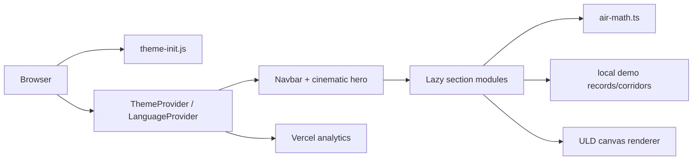
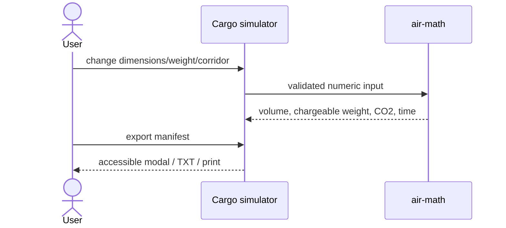
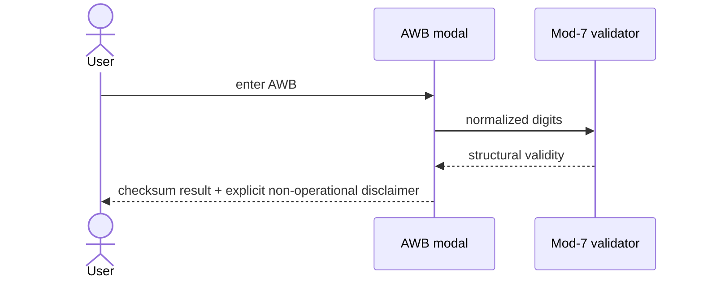
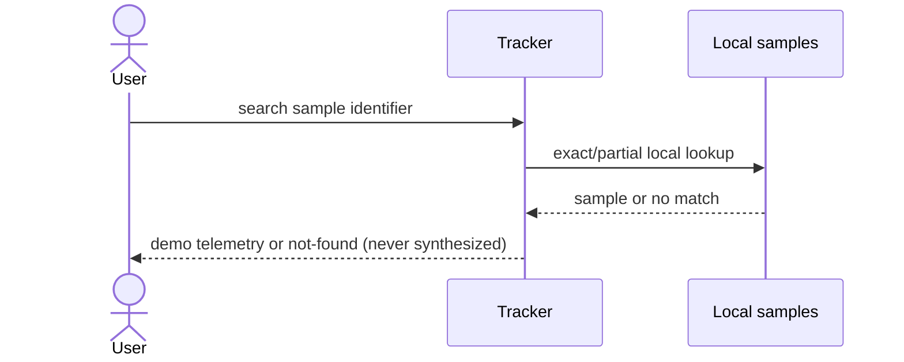

# Reconstruction, audit, and upgrade record

## Scope, classification, success

**Scope:** source checkout at commit `8b4496f`; authorization is assumed from the provided repository. No authentication, secrets, DRM, or third-party code was reverse-engineered. **Classification:** bilingual interactive marketing/tooling web app with logistics simulation and canvas-based 3D-style visualization.

**Success:** preserve the visual air-freight experience while making every operational claim clearly simulated, making the core tools testable and accessible, reducing initial JavaScript, enforcing security/performance gates, and enabling a newcomer to install and verify the project with one documented command.

**Visual decision:** rich motion and the ULD canvas genuinely support the aviation/digital-twin concept. They are retained, but reduced-motion remains honored and hero videos now preload metadata rather than both complete reels.

## Confirmed stack

| Finding | Status | Evidence |
|---|---|---|
| React 19 + TypeScript | CONFIRMED | `package.json`, `src/main.tsx` |
| Vite 6 + Tailwind CSS 4 | CONFIRMED | `package.json`, `vite.config.ts`, `src/index.css` |
| Static client-only deployment | CONFIRMED | no server entry point; all records are constants in components |
| English/Arabic and RTL | CONFIRMED | `src/lib/i18n.tsx` providers and root direction effect |
| Canvas pseudo-3D ULD renderer | CONFIRMED | `src/components/ULDViewer3D.tsx` |
| Vercel hosting | PROBABLE | Vercel Analytics and `vercel.json`; no deployment trace supplied |

## Architecture and flows

## Testable behavior

- Freight inputs must all be finite and greater than zero; invalid trust-boundary values throw `RangeError`.
- Volumetric kg is `L×W×H/6000`; chargeable kg is the greater of gross and volumetric, with gross winning equality.
- AWBs accept only 11 digits after spaces/hyphens are removed; the seven-digit serial modulo 7 must equal the check digit.
- AWB validation never asserts booking, customs, or shipment status.
- Tracker searches only the four bundled demo records; an unknown identifier returns not-found and no generated telemetry.
- Theme and language persist locally and update `data-theme`, `lang`, and `dir`.
- Open dialogs trap focus, close on Escape/backdrop, lock body scroll, and restore focus.
- Reduced-motion disables decorative animation; JavaScript/CSS chunks must stay below 300,000/120,000 bytes.

## Evidence and unknowns

| Claim | Confidence | Evidence |
|---|---|---|
| App has no live logistics integration | CONFIDENT | datasets in `ConsignmentTracker.tsx`, `corridors.ts`; no fetch/API client |
| Existing unknown AWBs previously produced plausible fake telemetry | CONFIDENT | baseline `ConsignmentTracker.tsx` fallback branch, now removed |
| Baseline CSP was duplicated and inconsistent | CONFIDENT | baseline `index.html` meta and baseline `vite.config.ts` build injection |
| Hero loaded two large videos eagerly | CONFIDENT | baseline `CinematicStage.tsx` had two `preload="auto"` elements |
| Production headers are active on Vercel | PROBABLE | `vercel.json`; deployment response was not available locally |
| Asset redistribution rights | UNKNOWN | no repository license/source ledger; resolve by obtaining owner records |
| Real-device Core Web Vitals/FPS | UNKNOWN | no representative device/network lab in this checkout; resolve with deployed Lighthouse/RUM |

## Ranked baseline audit and closure

Impact/effort are 1–5. “Closed” means implemented and verified here.

| # | Finding | I/E | Resolution |
|---|---|---:|---|
| 1 | Unknown AWBs fabricated operational records | 5/1 | **Closed:** unknowns now fail closed; regression test added |
| 2 | Checksum UI implied customs pre-clearance | 5/1 | **Closed:** claims removed; explicit boundary and test added |
| 3 | No automated tests or CI | 5/3 | **Closed:** 7 tests plus CI type/build/a11y/perf/security gates |
| 4 | 6,361 generated dependency files tracked | 4/1 | **Closed:** removed from Git index; lockfile remains reproducible |
| 5 | Duplicate/inconsistent CSP; inline script exception | 4/2 | **Closed:** external bootstrap, single compatible policy, host headers |
| 6 | Monolithic initial application imports | 4/2 | **Closed:** feature modules lazy-loaded with suspense |
| 7 | Both 8.3 MB and 6.3 MB hero videos eagerly preloaded | 4/1 | **Closed:** metadata preload; posters and reduced-motion retained |
| 8 | Manifest dialog lacked focus management/semantics | 4/2 | **Closed:** dialog primitive, Escape, backdrop, focus restoration |
| 9 | Calculation API accepted NaN/Infinity/non-positive values | 4/1 | **Closed:** finite positive validation and edge tests |
| 10 | No onboarding, security headers, or budgets | 3/2 | **Closed:** README, `.env.example`, headers, scripted budgets |

## Upgrade capabilities

1. Downloadable plain-text simulation manifest (in addition to copy/print), generated locally.
2. Recoverable lazy section loading with a user-visible error boundary and loading skeleton.
3. Keyboard skip navigation and fully managed manifest/AWB dialog interactions.
4. Truth-preserving tracker and AWB tools that clearly distinguish demonstrations/checksums from live operational data.

## Verification: baseline versus final

| Measure | Baseline | Final |
|---|---:|---:|
| Automated tests | 0 | 7 passing across 3 files |
| Production dependency vulnerabilities | not gated | 0 reported by `npm audit --omit=dev` |
| Main JS, raw | 392,607 B | 287,948 B (26.7% lower) |
| Main JS, gzip (local gzip) | 115,401 B | 91,218 B (21.0% lower) |
| JS chunks | 1 | 31 (feature code deferred) |
| CSS, raw | 90,750 B | 107,569 B (within 120 KB budget; increase from testable lazy-class discovery/new focus UI) |
| Hero video preload | 14.55 MB eligible for eager preload | metadata-only requests; byte transfer is browser/server dependent |
| Tracked `node_modules` entries | 6,361 | 0 |
| Type errors | baseline check exposed 16+ unused-code errors | 0 |
| Motion fallback | present | retained; no animation added |
| FPS / LCP / INP / CLS | not measured | not asserted; requires deployed browser/device telemetry |

Total visual assets remain approximately 22 MB in `public/assets`; no new visual asset was added. The app’s visual design and interaction model were preserved rather than adding unmeasured effects.

## Remaining risks / externally blocked work

1. **Asset license attestation:** impossible from repository evidence; owner must provide source/license records before redistribution.
2. **Live carrier/customs integration:** impossible without approved APIs, contracts, credentials, schemas, and privacy requirements. The UI now fails closed instead.
3. **Production Core Web Vitals and 60 FPS proof:** impossible to establish from static/local evidence alone; requires a deployed URL, representative devices/networks, and RUM. Bundle/preload budgets are enforced meanwhile.
4. **Authoritative tariff/emissions validation:** coefficients are explicitly estimates in code; formal sign-off requires current licensed tariff and GLEC datasets plus domain review.
