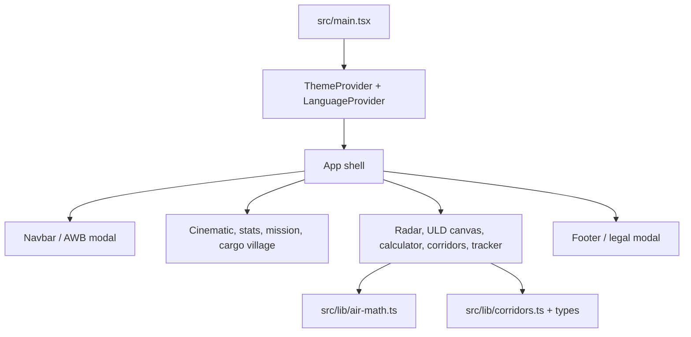

# YASLOGIST AIR reconstruction notes

## Scope and success
This repository is treated as owned or authorized project source. It is a React/Vite logistics experience; no protected third-party code or credentials were extracted. Success means a production build that preserves the freight calculators, tracker, ULD viewer, theme/language controls, and modal flows while remaining keyboard-accessible, resilient to an interactive-module failure, and reproducible in CI.

## Architecture

The app is a client-rendered single page. State is local React state; theme and language persist through local storage. Calculator outputs are deterministic from dimensions, weight, distance, and optional sea lane. AWB validation uses the seven-modulo check digit. The canvas ULD viewer is progressive enhancement: controls remain available if the visual module fails.

## Evidence and risks

| Claim | Evidence | Confidence |
|---|---|---|
| React 19 + Vite + TypeScript | `package.json`, `src/main.tsx` | Confirmed |
| Air math is client-side and deterministic | `src/lib/air-math.ts` | Confirmed |
| Dialogs implement focus trap/Escape restore | `src/lib/a11y.ts` | Confirmed |
| External live shipment APIs exist | no API client found in `src/` | Unknown |
| Runtime analytics availability | package declared but module absent in install | Unknown; removed broken import |

## Acceptance
See `tests/acceptance.md`. CI runs type checking, production bundling, and high-severity dependency audit. Heavy media remains in `public/assets`; the optimized JS output is 447.24 kB (130.86 kB gzip) and CSS is 111.55 kB (16.98 kB gzip) in the verified local build.
